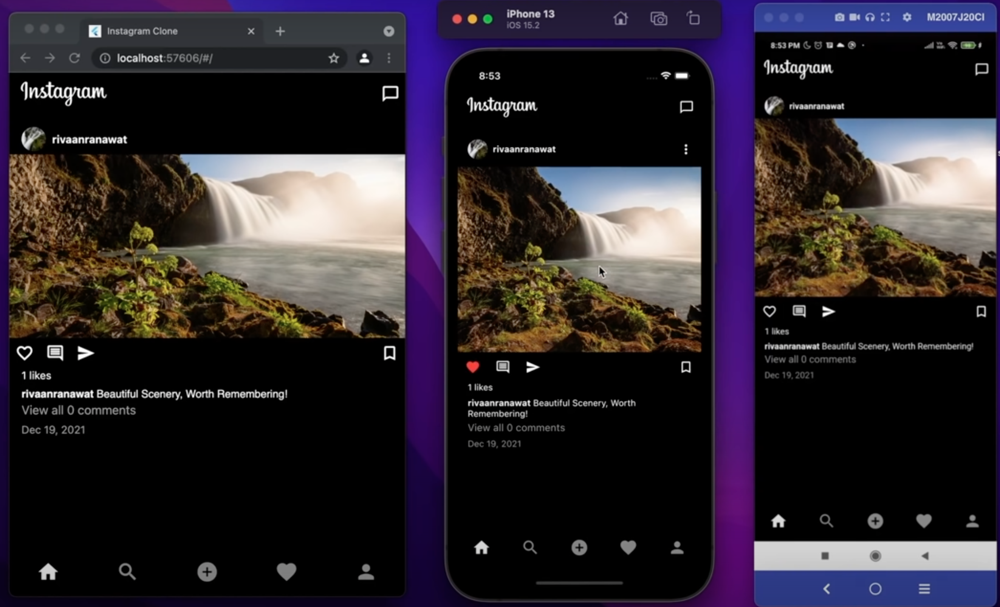
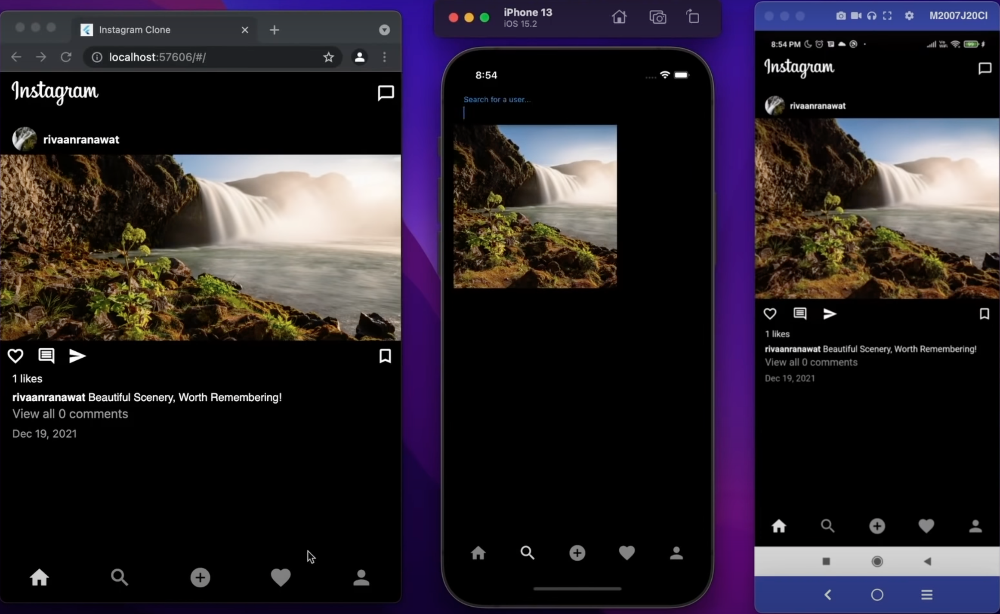
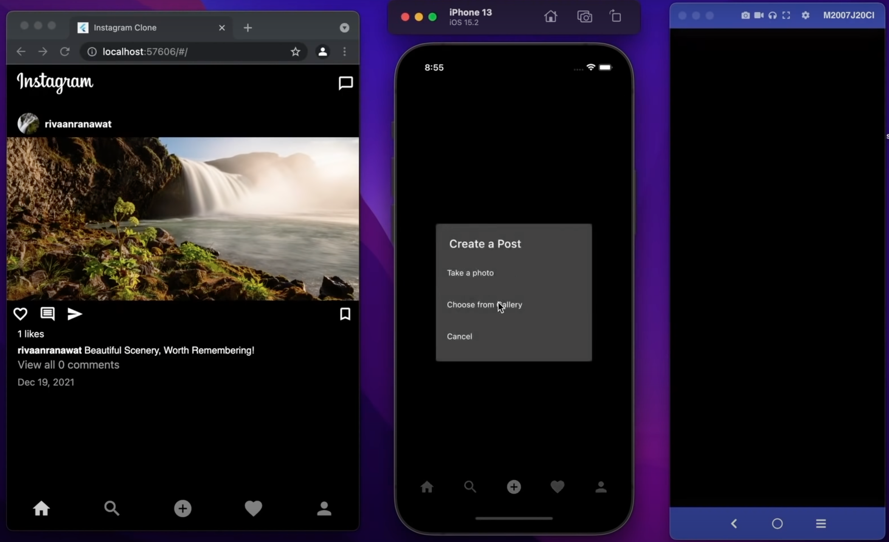
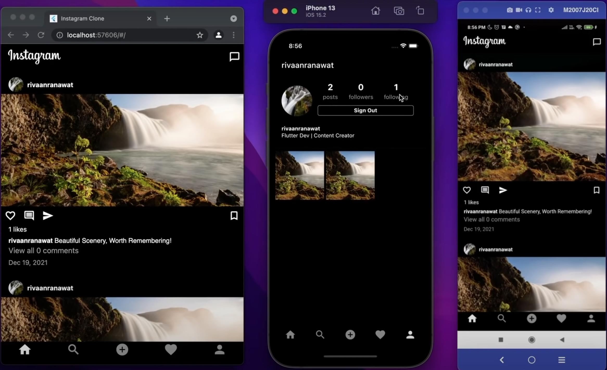

r

# Instachat
This is a free, online photo-sharing application and social network platfrom that works on Android, iOS & Web.

# Requirements
- Share Posts with Caption
- Display Posts with Caption
- Comment and like posts
- Search Users
- Follow Users
- Sell on platform
- Email & Password Authentication
- Sign In
- Sign Out
- Display User Posts, Followers & Following

# Tech Stack
- Flutter
- Firebase
- VS code

# Schema

### User
Users would be able to upload/download/view photos. Users can perform searches based on photo/video titles. Users can follow other users. The system should generate and display a user's News Feed consisting of top photos from all the people the user follows.

- Crawling
- Indexing
- Serving

### Project

- name: Instachat 
- description: textfield
- createdAt: timestamp
- updatedAt: timestamp

### Log
- text: textfield
- createdAt: timestamp
- updatedAt: timestamp
